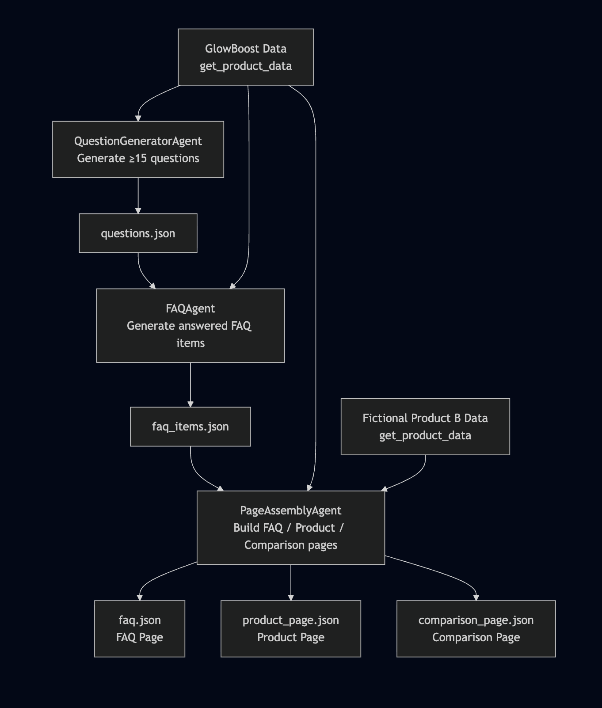

# Multi-Agent Content Generation System

This project implements a **multi-agent, LLM-driven content generation system** using **LangChain**, **Google Gemini**, and a **tool-based agent architecture**.

The system transforms a small, structured product dataset (GlowBoost Vitamin C Serum) into three fully generated content pages:

- **FAQ Page**
- **Product Description Page**
- **Comparison Page** (GlowBoost vs a fictional Product B)

All outputs are **pure JSON**, generated by LLM-powered agents following strict templates and schema rules.

The pipeline is executed end-to-end through `agent_execution.py`.

---

## 1. Problem Statement

The assignment requires designing an **agentic content-generation system** that:

- Consumes a strictly limited dataset for **one product only** (GlowBoost Vitamin C Serum).
- Generates **machine-readable JSON** content pages:

  - FAQ Page (≥ 15 questions → answered, categorized FAQs)
  - Product Detail Page
  - Comparison Page against a fictional Product B
- Demonstrates:

  - **Use of an established agentic framework (LangChain)**
  - **Real agents with tool usage**
  - **Model-driven content**
  - **Reusable templates and content patterns**
  - **Clear separation of responsibilities**
  - **End-to-end automated orchestration**

---

## 2. Solution Overview

The system uses:

- **LangChain** for agent workflows
- **Google Gemini 2.5 Flash** for LLM-powered generation
- **Custom LangChain tool** (`get_product_data`) to securely fetch product JSON
- **Three specialized agents**:

  1. **QuestionGeneratorAgent**
  2. **FAQAgent**
  3. **PageAssemblyAgent**

Each agent operates on structured JSON and passes its output to the next stage.

The system performs the following:

1. Load product JSON via LangChain tool
2. Generate ≥ 15 categorized questions
3. Convert questions into structured FAQ items
4. Assemble FAQ, Product, and Comparison pages using strict schemas
5. Export everything into `/output/`

---

## 3. Scope & Assumptions

### **3.1 Scope**

- Only the provided **GlowBoost** dataset is used.
- A fictional **Product B** dataset is included for comparison.
- No external product data sources are permitted.
- Output is restricted to **JSON pages**:

  - `faq.json`
  - `product_page.json`
  - `comparison_page.json`
- Entire pipeline must run through **LLM-powered agents**.

### **3.2 Assumptions**

- LLMs may paraphrase but must not introduce new factual claims.
- Product B is allowed because the challenge explicitly requires a comparison page.
- The architecture must be generalizable for future product datasets.
- Every agent must be modular and replaceable.

---

## 4. System Design

### **4.1 Architecture Overview**

The system contains **three real LangChain agents**, each with a single responsibility:

| Agent                            | Responsibility                                                  |
| -------------------------------- | --------------------------------------------------------------- |
| **QuestionGeneratorAgent** | Generates ≥15 categorized questions about GlowBoost            |
| **FAQAgent**               | Converts questions into structured FAQ items using product JSON |
| **PageAssemblyAgent**      | Produces the FAQ Page, Product Page, and Comparison Page        |

A single **LangChain tool** (`get_product_data`) provides controlled access to product JSON files.

`agent_execution.py` orchestrates the agent pipeline.

---

## 4.2 Data Flow

1. `QuestionGeneratorAgent`

   - Reads GlowBoost data via tool
   - Outputs: `questions.json`
2. `FAQAgent`

   - Reads GlowBoost data via tool
   - Inputs: questions
   - Outputs: `faq_items.json`
3. `PageAssemblyAgent`

   - Reads GlowBoost + Product B data via tool
   - Uses FAQ items to build:

     - `faq.json`
     - `product_page.json`
     - `comparison_page.json`

All steps use **LLM-driven, schema-constrained generation**.

---

## 4.3 Templates & Schemas

The system enforces strict JSON templates defined in `templates.py`:

### **FAQ Page Schema Includes:**

- Page metadata
- Product metadata
- Intro text
- Category groups
- FAQ items:

  - id
  - question
  - answer
  - priority
- ISO timestamp

### **Product Page Schema Includes:**

- Hero section
- Benefits block
- Usage block
- Ingredients list
- Safety block
- Price section
- FAQ preview
- ISO timestamp

### **Comparison Page Schema Includes:**

- Primary (GlowBoost) vs Secondary (Product B)
- Feature comparison:

  - Skin type
  - Ingredients
  - Vitamin C concentration
  - Benefits
  - Price
- Summary + recommendations
- ISO timestamp

---

## 4.4 Reusable Content Logic Patterns

Although content is LLM-generated, the project uses **consistent reusable structure**, enforced through:

- JSON schema blocks:

  - `benefits_block`
  - `usage_block`
  - `safety_block`
  - `price_block`
- Template-based formatting
- Prompt-driven consistency rules

These act like “logic blocks” that ensure each page has uniform structure.

---

## 4.5 Multi-Agent Execution Flow (DAG)

Executed via `python -m src.agent_execution`



## 4.6 Extensibility & Generalization

This system is architected for scalability:

### **Product-agnostic**

- Templates use generalizable JSON patterns
- Agents operate on any product JSON following the same schema

### **LLM-Driven**

- All content is model-generated and schema-controlled

### **Modular Agents**

- New agents can be added (e.g., SEOAgent, SummaryAgent) and existing agents can be replaced with improved or local LLMs

### **Future Product Catalog Support**

- Adding a new product only requires adding a new JSON file
- No changes needed in the agent code

---

## 5. Output Files

Execution generates the following files in `/output/`:

| File                     | Description             |
| ------------------------ | ----------------------- |
| `questions.json`       | Raw generated questions |
| `faq_items.json`       | Structured FAQ items    |
| `faq.json`             | Final FAQ page          |
| `product_page.json`    | Product detail page     |
| `comparison_page.json` | Comparison page         |

All conform to strict JSON schemas.

---

## 6. Running the System

Install requirements:

```bash
pip install -r requirements.txt
```

Set your Gemini API key in `.env`:

```bash
GOOGLE_API_KEY="ENTER_YOUR_KEY_HERE"
```

Run the full pipeline:

```bash
python -m src.agent_execution
```

This will automatically:

* Load product data
* Generate questions
* Create FAQ items
* Build all three content pages
* Save final JSON files
