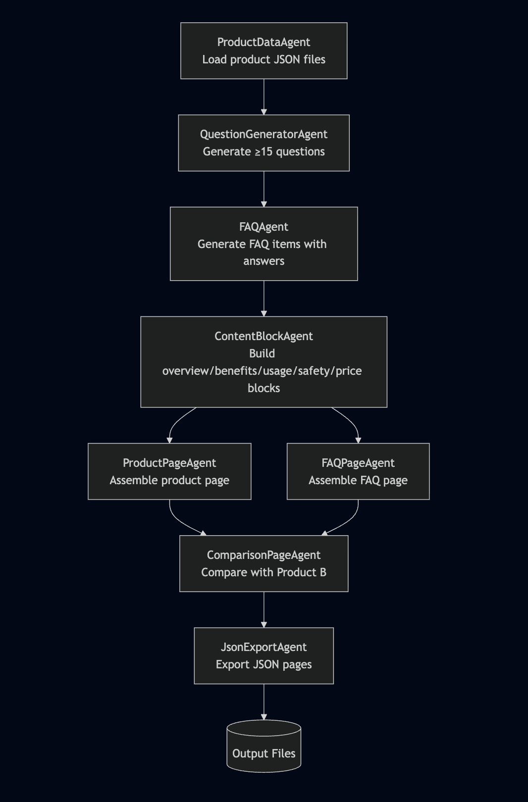

# Multi-Agent Content Generation System

This project implements a multi-agent content generation system that transforms a small structured dataset for a single product, **GlowBoost Vitamin C Serum**, into three machine-generated content pages:

1. **FAQ Page**
2. **Product Description Page**
3. **Comparison Page** (using a fictional Product B)

All content is produced through a clean, modular, agent-based architecture, using templates and reusable content logic blocks.

The entire pipeline runs via `agent_execution.py`.

---

# 1. Problem Statement

The challenge requires designing and implementing a **multi-agent automated content generation system** that:

- Accepts a **strictly limited product dataset** (GlowBoost Vitamin C Serum).
- Generates **structured JSON pages**:

  - FAQ Page with ≥ 5 answered FAQs
  - Product Description Page
  - Comparison Page between GlowBoost and an internally generated fictional Product B
- Demonstrates:

  - Agent design & clear separation of responsibilities
  - A well-structured orchestration pipeline
  - Template-driven page generation
  - Reusable content logic blocks
  - Machine-readable JSON output
  - System extensibility for future product datasets

---

# 2. Solution Overview

The system is built using Python and follows a **modular multi-agent architecture**.

Each agent has a **single responsibility**, clearly defined **inputs & outputs**, and communicates through structured data models.

### The system performs the following automated steps:

1. **Load and parse product data** using `ProductDataAgent`.
2. **Generate ≥15 categorized questions** using `QuestionGeneratorAgent`.
3. **Generate answered FAQ items** using `FAQAgent`.
4. **Generate reusable content blocks** using `ContentBlockAgent`.
5. **Assemble the Product Page**, FAQ Page, and Comparison Page using their respective agents.
6. **Export all results as JSON** using `JsonExportAgent`.
7. **Execute full pipeline automatically** via `agent_execution.py`.

---

# 3. Scopes & Assumptions

## 3.1 Scope

- Only the GlowBoost dataset is used (no external data).
- System must output three structured JSON content pages.
- Agents must be modular, composable, and follow single-responsibility principles.
- All content must come from templates and logic blocks, not free-form text.
- System must be fully automated end-to-end.

## 3.2 Assumptions

- GlowBoost’s data cannot be enriched from external sources.
- A fictional Product B is allowed solely for the comparison page.
- The system should be generalizable to new products following the same schema.
- LLMs are optional; a deterministic agent-based architecture is fully acceptable.

---

# 4. System Design

This section outlines the core architecture, agent responsibilities, templates, and data flow.

---

## 4.1 System Architecture Overview

The system is decomposed into **eight agents**, each with a single, isolated responsibility.

### Agent List

| Agent | Responsibility |

|-------|----------------|

|**ProductDataAgent**| Load & parse JSON product files |

|**QuestionGeneratorAgent**| Generate ≥ 15 categorized user questions |

|**FAQAgent**| Produce answered FAQ items with priorities |

|**ContentBlockAgent**| Generate reusable content logic blocks |

|**ProductPageAgent**| Build product detail page |

|**FAQPageAgent**| Build categorized FAQ page |

|**ComparisonPageAgent**| Build comparison page between GlowBoost and Product B |

|**JsonExportAgent**| Export all pages to JSON |

|**agent_execution.py**| Orchestrates entire multi-agent pipeline |

---

## 4.2 Data Models

The system uses typed Python dataclasses:

- `Product`
- `Question`
- `FAQItem`
- ISO-8601 timestamp helpers

These ensure strict data structure, clarity, and stable inter-agent communication.

---

## 4.3 Page Templates

Each page type follows a custom, engineered JSON schema.

### FAQ Template Includes:

- Page metadata
- Product metadata
- Intro text
- Categorized FAQ groups
- FAQ items with:

  - id
  - question
  - answer
  - priority

---

### Product Description Page Template Includes:

- Hero section (name, tagline, highlights)
- Benefits section (logic block)
- Usage section (logic block)
- Ingredients list
- Safety section (logic block)
- Price section (logic block)
- FAQ preview section (top FAQs)
- Timestamp

---

### Comparison Page Template Includes:

- Primary (GlowBoost) vs Secondary (Product B)
- Comparison summary
- Feature comparison points:

  - Skin type
  - Vitamin C concentration
  - Ingredients
  - Benefits
  - Price
- Recommendations
- Timestamp

---

## 4.4 Content Logic Blocks (Reusable)

Agent-generated reusable blocks:

- **OverviewBlock**
- **BenefitsBlock**
- **UsageBlock**
- **SafetyBlock**
- **PriceBlock**

These modular blocks enable consistent formatting across pages and ensure the system is **extensible**.

---

## 4.5 Multi-Agent Execution Flow (DAG)

Below is the complete flow executed by `agent_execution.py`:



## 4.6 Extensibility & Generalization

Although only one real product dataset (GlowBoost Vitamin C Serum) is provided, the entire system is intentionally designed to be **fully generalizable** to any future product dataset following the same schema.

Key extensibility features include:

- **Product-Agnostic Templates:**

  The FAQ page, product page, and comparison page templates accept any `Product` object and do not require GlowBoost-specific logic.
- **Reusable Content Blocks:**

  Logic blocks such as `build_benefits_block()` and `build_usage_block()` can operate on any product, enabling the system to scale to catalog-sized automation.
- **Modular Agents:**

  Each agent is written with single responsibility, allowing new agents to be added, replaced, or upgraded independently (e.g., swapping rule-based agents with LLM-powered ones).
- **Fictional Product B Support:**

  While GlowBoost must use the provided dataset, the architecture allows generating or loading additional products for comparison expandability.
- **Clear Schemas:**

  The `Product`, `Question`, and `FAQItem` models enforce data consistency across all stages of processing.

Overall, even though the challenge provides data for only one product, the system is engineered for reusability, modularity, and future expansion.

---

# 5. Output Files

At the end of execution, the system writes three structured JSON files into the `output/` directory:

- `faq.json` — Structured FAQ page grouped by categories
- `product_page.json` — Product detail page with reusable content blocks
- `comparison_page.json` — Comparison between GlowBoost and Product B

All the files follow consistent internal schemas.

---

# 6. Running the System

Execute the full multi-agent pipeline with:

```bash

python -m src.agent_execution.py

```

This will:

1. Load product data
2. Generate questions
3. Produce FAQ items
4. Construct content blocks
5. Build three content pages
6. Export the resulting JSON files
